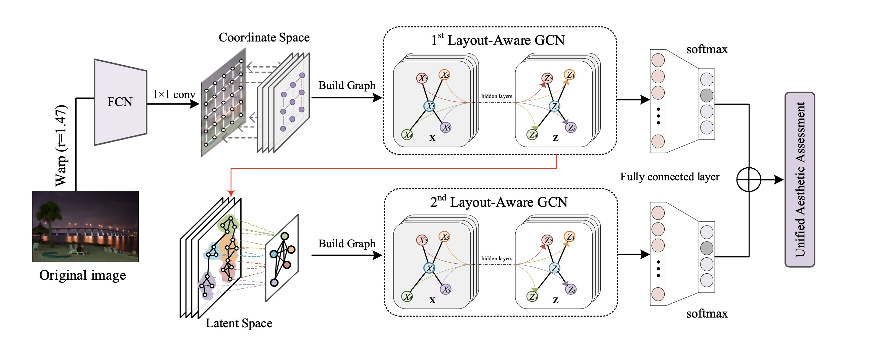

# Hierarchical Layout-Aware Graph Convolutional Network for Unified Aesthetics Assessment

[[Paper](https://openaccess.thecvf.com/content/CVPR2021/papers/She_Hierarchical_Layout-Aware_Graph_Convolutional_Network_for_Unified_Aesthetics_Assessment_CVPR_2021_paper.pdf)]  [[Supplementary Material](https://openaccess.thecvf.com/content/CVPR2021/supplemental/She_Hierarchical_Layout-Aware_Graph_CVPR_2021_supplemental.pdf)]  [[Jittor Code](https://github.com/shedy-pub/hlagcn-jittor)]  [[Pytorch Code]()(coming soon)]

This repository contains a <a href="https://github.com/Jittor/Jittor" target="_blank">Jittor</a> implementation of the paper "Hierarchical Layout-Aware Graph Convolutional Network for Unified Aesthetics Assessment" (CVPR 2021)



## Contents

* [Requirements](#Requirements)
* [Install](#Install)
* [Dataset](#Dataset)
* [Training](#Training)
* [Testing](#Testing)
* [Citation](#Citation)

### Requirements

[Jittor](https://github.com/Jittor/Jittor#install) environment requirements:

* System: **Linux**(e.g. Ubuntu/CentOS/Arch), **macOS**, or **Windows Subsystem of Linux (WSL)**
* Python version >= 3.7
* CPU compiler (require at least one of the following)
  * g++ (>=5.4.0)
  * clang (>=8.0)
* GPU compiler (optional)
  * nvcc (>=10.0 for g++ or >=10.2 for clang)
* GPU library: cudnn-dev (recommend tar file installation, [reference link](https://docs.nvidia.com/deeplearning/cudnn/install-guide/index.html#installlinux-tar))

### Install

- Clone repo

```
git clone https://github.com/shedy-pub/hlagcn-jittor
cd hlagcn-jittor
```
- Install dependencies ( jittor, imageio, scikit-learn, opencv-python, pandas. Recommend to use [Anaconda](https://www.anaconda.com/).)

```
# Create a new conda environment
conda create -n menv python=3.8
conda activate menv

# Install other packages
pip install -r requirements.txt
```

### Dataset

- AVA dataset

  - Download the original [AVA dataset](https://github.com/mtobeiyf/ava_downloader/tree/master/AVA_dataset) and  [dataset spilt](https://github.com/BestiVictory/ILGnet) into `path_to_AVA/`. The directory structure should be like:

```
path_to_AVAdataset
├── aesthetics_image_list
├──images
├──AVA.txt
├──trian.txt
└──val.txt
```

- AADB dataset
  - Download the AADB dataset](https://www.ics.uci.edu/~skong2/aesthetics.html) into `path_to_AADB/`.
  - The directory structure should be like:

```
path_to_AADBdataset
├──AADB_imgListFiles_label
├──datasetImages_originalSize
└──AADB_AllinAll.csv
```


### Training

Traning scripts for two datasets can be found in  `scripts/`. The `dataroot` argument should be modified to `path_to_<dataset_name>`. Run the follwing command for training:

```
# Training on AVA
sh script/train_jittor_aadb.sh

# Training on AABD
sh script/train_jittor_aadb.sh
```

*Our code will process the dataset information and save file in `preprocess/`, which needs few minutes for the first time.*

### Testing

Testing model by runing the scripts or the follwing command:

```
python -m utils_jittor.eval \
    --dataset <dataset_name> \
    --dataroot path_to_<dataset_name> \
    --eval_model path_to_model
```

### Citation

If you found this code useful please cite our work as:

```
@InProceedings{She_2021_CVPR,
    author    = {She, Dongyu and Lai, Yu-Kun and Yi, Gaoxiong and Xu, Kun},
    title     = {Hierarchical Layout-Aware Graph Convolutional Network for Unified Aesthetics Assessment},
    booktitle = {Proceedings of the IEEE/CVF Conference on Computer Vision and Pattern Recognition (CVPR)},
    month     = {June},
    year      = {2021},
    pages     = {8475-8484}
}
```